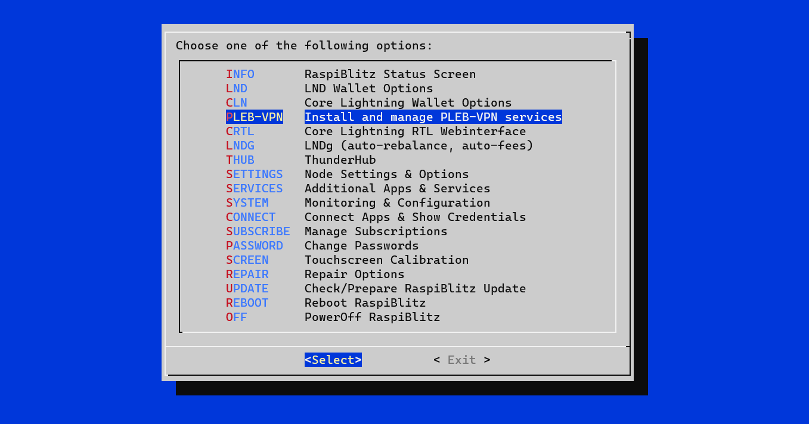
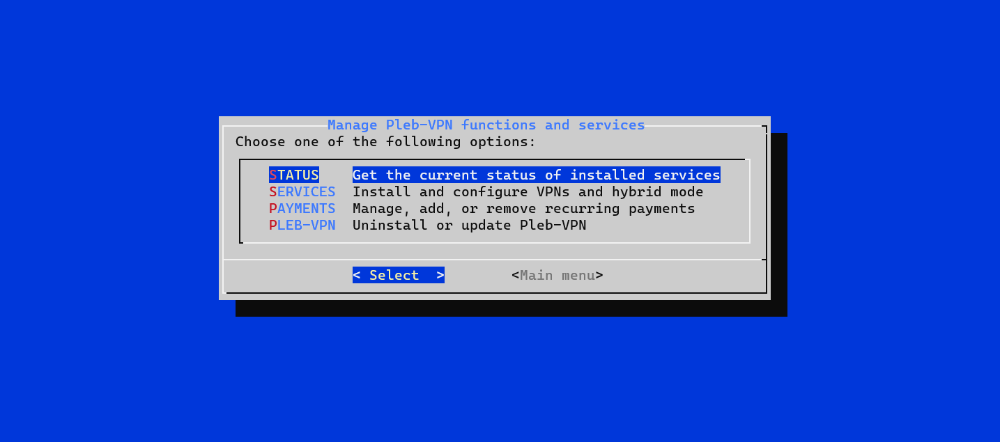
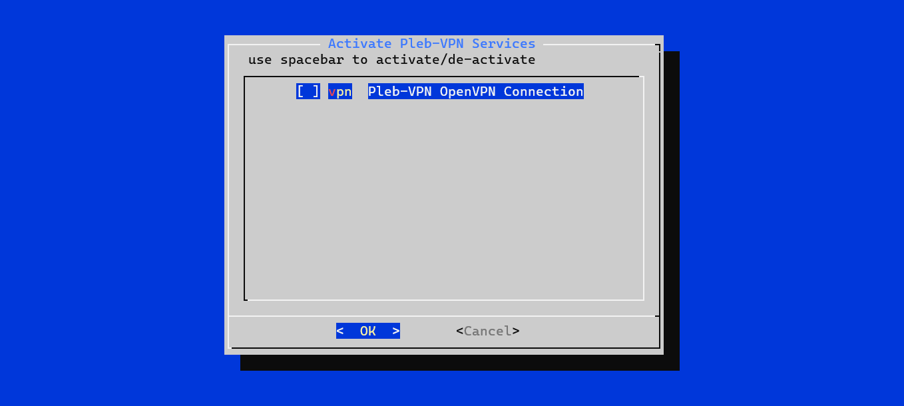
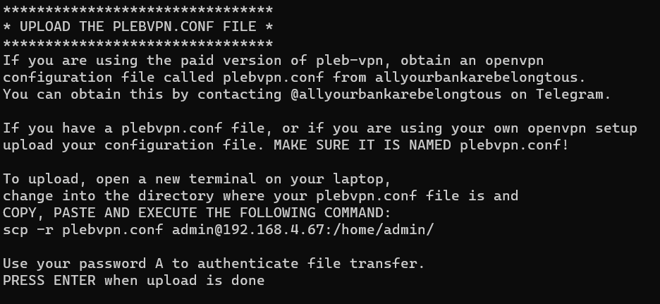
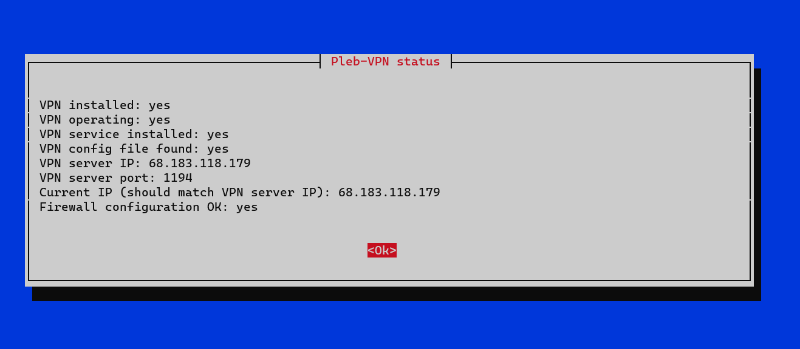
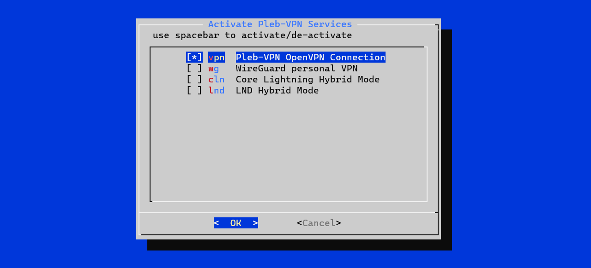
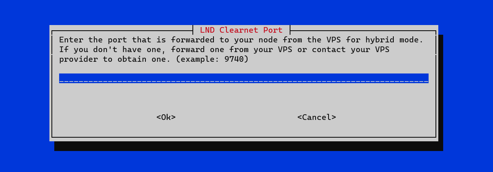
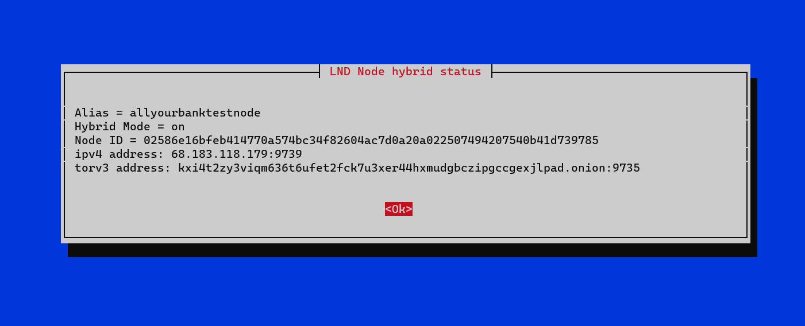

<!-- omit in toc -->
#   

# Pleb-VPN  
_Easy VPS sharing for cheaper hybrid solution for Plebs...built for Raspiblitz._

`Version 0.9.0rc1 including LND hybrid, CLN hybrid, WireGuard, and recurring payments`

**Pleb-VPN is a Raspiblitz tool set that allows you to easily take your node
from a tor-only node to a hybrid solution with a public Virtual Private Server
 - either yours or someone elses! It also includes a number of tools to facilitate 
this, including an easy-to-install implementation of WireGuard for private, secure 
VPN access to your node anywhere, anytime, and the ability to automatically send 
recurring payments over lightning via keysend.**

Pleb-VPN was born out of the realization that tor was always going to be
insufficient for routing nodes, and that most Plebs either won't afford
or can't set up (or both) a VPS with a VPN and enable hybrid mode on their
node. Enter Pleb-VPN! This enables easy VPS sharing and lowers the cost of
going clearnet for Plebs.

Pleb-VPN is a free open-source Raspiblitz integration of OpenVPN and WireGuard, 
and includes scripts to configure either LND or Core Lightning (or both!) for 
hybrid mode. You may use this in conjunction with your own VPS set up as an 
OpenVPN server, or you may contact me on TG @allyourbankarebelongtous or via email: 
allyourbankarebelongtous@protonmail.com, agree to a small monthly fee (I don't know 
how much it will cost me to expand yet or how big the demand is so accurate 
pricing is difficult to predict), and obtain access to my VPS to go clearnet. 
You would be paying for VPS access/use, not for Pleb-VPN.

If there are any other Plebs who want to share their VPS for a small fee, feel free
to advertize and direct interested parties here for the easy-to-implement Raspiblitz
hybrid option! This will work with any public VPN (in the sense that the IP of the VPS 
is for public access) that uses OpenVPN for its connection and allows port forwarding.

**You can also set up your VPS to share with others as a VPN if you like to help
increase the availability of clearnet/hybrid nodes on the lightning network!**

---
<!-- omit in toc -->
## Table of Contents

  - [How it works](#how-it-works)
  - [FAQ](#faq)
  - [Install instructions](#install-instructions)
  - [Getting started](#getting-started)
    - [Connect the VPN](#connect-the-vpn)
    - [Go Hybrid](#go-hybrid)
    - [Installing WireGuard](#installing-wireguard)
    - [Recurring Payments](#recurring-payments)
    - [Updates or Uninstalling](#updates-or-uninstalling)

---

## How it Works  
Pleb-VPN uses OpenVPN to connect to a Virtual Private Server (VPS) and configures
Raspiblitz to only use that connection to go to the outside world (your home LAN
remains unaffected and can access the blitz still). At this point, your public
facing IP address becomes the IP address of the VPS. The connection between the VPS
and the Raspiblitz is encrypted by the OpenVPN protocol. From there, going to a
hybrid or clearnet solution for LND or Core Lightning is more private as you 
will not release your home IP to the outside world.

Pleb-VPN provides easy Raspiblitz menu access to install and configure OpenVPN,
and then configure hybrid mode on or off for either LND or Core Lightning (or
both). Pleb-VPN configures the node such that if the VPS goes offline you will
not accidentally release your home IP (called a killswitch).

Pleb-VPN also provides ease Raspiblitz menu access to install and configure WireGuard,
a private VPN service that will run through the VPS encrypted end-to-end from the
Raspiblitz to any client connected to the blitz that you configure, giving you 
a secure, simulated LAN that allows you to securely access all features of your
Raspiblitz as if you were home, from anywhere in the world. This feature is entirely
set up locally on the Raspiblitz, so even if you are sharing a VPS with someone you 
don't know, they'll never get access to your Raspiblitz.

Finally, Pleb-VPN comes with the ability to automatically send recurring payments 
over lightning via keysend. _(credit to m00ninite's excellent scripts, found here: 
https://github.com/rootzoll/raspiblitz/pull/2404)._

**Pleb-VPN also ensures that all configurations will remain when you reflash the SD 
card for Raspiblitz updates.**

## FAQ  
**How is this different than TunnelSats?**  
Good question. It's really not that much different. TunnelSats uses one or more
shared servers and provides you with a cert to connect to them, only it uses WireGuard
instead of OpenVPN for the connection. TunnelSats has an advantage in that it
split-tunnels tor and clearnet, so if the VPN server drops offline you still have
tor, Pleb-VPN does not. TunnelSats is also available for other node implementations.
However, Pleb-VPN is cheaper, and encourages Plebs to collaborate to make the lightning
network more decentralized (less reliance on one or two providers) and more robust
(more hybrid/clearnet nodes).

**How secure is this**  
It's as secure as any VPN. The OpenVPN encryption is AES-256-CBC, and WireGuard uses
Curve25519 point multiplication as its primary method of private key/public key
encryption. The owner of the VPS (this is true regardless of if you run it yourself
or if you share) _will_ know your home IP address. They will _NOT_ have access to
your LAN, your WireGuard virtual LAN, or your Raspiblitz itself. A bonus of sharing
a VPS is that there is no KYC required...the only knowledge the VPS owner will have
that the rest of the world doesn't have is your home IP address.

**Can I use this on an Umbrel/MyNode/Raspibolt/etc implementation?**  
Sort of. The actual software here on GitHub is only for Raspiblitz, but if you
can find a guide to install OpenVPN and take your node clearnet on your own nothing
is stopping you from contacting @allyourbankarebelongtous or anyone else willing to
share a VPS and paying them a small fee to gain a clearnet IP and a couple of forwarded
ports. You will have to figure out how to change the port LND or Core Lightning uses 
to talk to the outside world with as well. There are numerous guides on how to do this.

**I want to update my node. What do I need to do?**  
Update like normal according to Raspiblitz instructions. Pleb-VPN will automatically
reinstall and reconfigure to match what you had before, including any recurring 
payments scheduled.

**Can I remove Pleb-VPN?**  
Yes. The menu provides an option to completely uninstall and restore the original
node configuration at any time.

**What if Pleb-VPN scripts are updated? How do I update mine?**  
The menu has an option to update the scripts by pulling them from GitHub. It takes about 
a half a second and keeps all of your settings.

## Install Instructions:  
1. Exit to command line from the menu (you should be in directory /home/admin).  
2. From /home/admin, clone the repository by copying and pasting the following command:  
   `git clone https://github.com/allyourbankarebelongtous/pleb-vpn.git`  
3. Fix the permissions, copy, paste into the command line, and run:  
   `sudo chmod -R 755 /home/admin/pleb-vpn`  
4. Run the install script by copying and pasting:  
   `/home/admin/pleb-vpn/pleb-vpn.install.sh on`  

Access Pleb-VPN from the menu and try it out!

## Getting Started:  
After install you should have a menu that looks like this:  

Select "PLEB-VPN" to enter the Pleb-VPN Main Menu:  

Here there are five options available, although you will initially only see four.  
These options are:  
STATUS - Get the current status of installed services  
SERVICES - Install and configure VPNs and hybrid mode  
PAYMENTS - Manage, add, or remove recurring payments  
WIREGUARD-CONNECT - Get WireGuard config files for clients (only shows when WireGuard installed)  
PLEB-VPN - Uninstall or update Pleb-VPN  

### Connect the VPN
Looking at the SERVICES menu, you will only see one option initially:  

Initially the only thing you can activate is Pleb-VPN, which is the OpenVPN connection
to the VPS that gives you a public IP different than your home IP. Activating the other
services without this will only dox your home IP (WireGuard wouldn't, but unless you
have a static home IP, which is unlikely, you'd have to constantly re-configure WireGuard).

After activating Pleb-VPN, you are asked to send the OpenVPN config file (called plebvpn.conf)
to the node using scp. The node gives you the command to run. If you already have uploaded
it and are just re-enabling Pleb-VPN, it will find the old .conf file and ask if you
want to keep it or upload a new one.  

Once the script has run, it will check the status of the VPN connection and display the
status screen:  

Once your VPN is connected it will automatically restart every time the Raspiblitz
starts up. If for some reason you want to manually disconnect without uninstalling,
you can use the command line:  
Stop (service will still start on boot): `sudo systemctl stop openvpn@plebvpn`  
Disable (service will not start on boot): `sudo systemctl disable openvpn@plebvpn`  
Enable (autostart on boot): `sudo systemctl enable openvpn@plebvpn`  
Start (start now): `sudo systemctl start openvpn@plebvpn`  

### Go Hybrid
Now that your VPN connection to the VPS is up, the SERVICES menu shows more options:  

From here, it should show the option to enable hybrid mode on whichever node implementation
is active on your node. If the service detects that both are installed, it will display
both, as shown here. Lets activate hybrid mode for LND (the steps are identical for Core Lightning).

The first thing the script will do is ask for a port to use. This is because to share
a server, the nodes have to use different ports. If you got your plebvpn.conf from
another pleb, you should also get a port to use for your node. This is where you enter
the port:  

If you've already entered a port, the script will use the port already entered (i.e., for
re-enabling hybrid after turning it off). The process is the same for Core Lightning.  
_If you use both node implementations side by side, they MUST use different ports!_

After it finishes the configuration and the wallet is unlocked, the script displays the 
status which should now show your new clearnet address and port. If you have channels 
connected, this data should reflect on lightning explorers such as amboss.space within 
an hour (takes time for the gossip data to propogate).  

BOOM! You now have a hybrid node with a VPS!

### Installing WireGuard
Let's install WireGuard next. Using the services menu, toggle WireGuard on.
The first thing the script will ask is for you to chose an ip address for the node. This
is a private IP address, and can be anything in the range of 10.0.0.0 to 10.255.255.252
(the reason for it only going to 252 is that there are three client IPs which need to
be added).  

Next the script will ask you for a port, just like the hybrid mode script. 
Your VPS provider (or yourself, if you run your own server) can give you this port 
as well. Enter it here. _Do not use the same port as your node!_  

After that's done, the script will instruct you to download the WireGuard client app
from the google or apple app store. With that app, scan the QR code that will display
on the screen. This will give your phone the private key it needs to securely connect
with your node (these keys are generated locally and never leave your node until you 
download them via the WIREGUARD-CONNECT menu option). Once install is finished, the 
script will present you with the status of your connection, which will look like this:

In this example I chose 10.0.0.0, so that's the IP I will use to connect to my apps on
the Raspiblitz.

You can also obtain the WireGuard client conf files from the WIREGUARD-CONNECT menu
within the main Pleb-VPN menu. You will get three files, one (mobile.conf) is also
displayed as a QR code, but the other two (laptop.conf and desktop.conf) are only
available via scp download through the WIREGUARD-CONNECT menu. To configure more than
three clients will require you to manually edit the WireGuard configuration. There
are several tutorials out there on how to do this.

Once you have WireGuard configured, you can turn it on on your phone and connect to
any service on your node securely by using the WireGuard IP you selected. For example,
to connect to thunderhub, have the WireGuard client activated on your phone and 
enter ip.ip.ip.ip:3010 on your phone's browser. To access the blitz api, enter ip.ip.ip.ip.
To configure Zeus to connect over WireGuard, uncheck tor and enter your WireGuard ip in
place of the tor address.  

_Note: Because the connection is secured by WireGuard there is no need to enable ssl encryption, 
but you can anyways if you download the cert and install it on your phone. You will need to 
re-create the cert first to ensure it includes your WireGuard IP. This can be done by either 
using the Raspiblitz Menu, going to CONNECT and then RESET, which will also reset your 
macaroons (you will have to reconnect any mobile wallets or other apps which use macaroons), 
or by deleting /mnt/hdd/lnd/tls.cert and /mnt/hdd/lnd/tls.key, restarting lnd, and 
restarting nginx._   

Here's a screenshot of me accessing the blitz api via WireGuard on my
phone using the 10.0.0.0 IP shown above:  

### Recurring Payments
Lastly, let's check out payments. Payments were included in this to encourage VPS 
operators to open their servers to other clients, and to make paying for VPS 
services easier for Plebs. Here is the PAYMENTS menu:  

Here you can schedule recurring keysends using either LND or Core Lightning as your 
node. The service lets you decide which one to use if you have both installed. It also
lets you schedule the payment in sats or USD, and does the USD-sat conversion in real-time 
each time it sends. The PAYMENTS menu has four sections:  
NEW - lets you create a new recurring payment  
VIEW - displays all current active payments and their schedule  
DELETE - allows you to select a payment from among all of them and delete it  
DELTEALL - deletes all payments  

The process of scheduling a new payment is self-explanatory, but for fun here's what 
it looks like on a Raspiblitz that has two nodes running.

After selecting new, the script asks what denomination to use:  

Then the script asks how much you want each payment to be:  

Then which node you want to use (only asks if you have both LND and Core Lightning installed and enabled):  

Then asks for the pubkey of the receiver:  

Then how often to send:  

That's it. The payment is scheduled! The script will NOT send the payment right away,
it will wait until 00:00:00 UTC, and only send on the following schedule:  
DAILY - Every day at 00:00:00 UTC  
WEEKLY - Every Sunday at 00:00:00 UTC  
MONTHLY - Every 1st day of the month at 00:00:00 UTC  
YEARLY - Every 1st day of the year at 00:00:00 UTC  

Use VIEW to view your currently scheduled payments. Here's an example of me paying myself
a bunch of times for testing purposes from both LND and Core Lightning:  

Use DELETE to get rid of a payment. Here's what that looks like:  

Use DELETEALL to delete all payments.  

Payments that are scheduled will remain through Raspiblitz updates. The payments are
enabled using systemd timers that activate the service that sends the payments. If your
node is down during a payment send time, the node will attempt to send the payment up to
10 times, and if it doesn't get a successful return after that, that payment _will NOT
send again_ until you manually re-enable the payment. To re-enable payments you can
reboot the Raspiblitz (easiest), or manually start them using systemd commands to 
restart the timers. To manually send an individual missed payment you can run the keysend 
scripts that are saved in /home/admin/pleb-vpn/payments/keysends, or to send all payments
that were scheduled at a certain time you can manually run that service with the following:  
`sudo systemctl start payments-<frequency>-<lnd or cln>.service`  where `<frequency>` is either
`daily`, `weekly`, `monthly`, or `yearly`, and  `<lnd or cln>` is either `lnd` if I'm using
LND or `cln` if I'm using Core Lightning.

For example, to manually at any time send the payments that were scheduled on the 1st of the
month to come from my lnd node I would run on the command line:  
`sudo systemctl start payments-monthly-lnd.service`

### Updates or Uninstalling
The last menu, PLEB-VPN, is for updates or uninstalls. Update just pulls the latest changes
to the scripts from github (for bug fixes or new features). Uninstall will uninstall EVERYTHING
you have and restore your node to its original configuration. It will NOT delete your
plebvpn.conf file and your WireGuard config files, they will be left on the hard drive.
To remove them, you can delete /mnt/hdd/app-data/pleb-vpn and all of its contents.

Feel free to contact me on Telegram @allyourbankarebelongtous or via email at:  
allyourbankarebelongtous@protonmail.com with any questions. PRs welcome!

**Happy Routing!**
