<!-- omit in toc -->
#   
  

# Pleb-VPN  
_Easy VPS sharing for cheaper hybrid solution for Plebs..._

`Version 1.1.0 with a Web User Interface and mynode integration`

**Pleb-VPN is a lightning node networking tool set that allows you to easily take your node
from a tor-only node to a hybrid solution with a public Virtual Private Server, _either yours 
or someone elses!_ It also includes a number of tools to facilitate this, including an 
easy-to-install implementation of WireGuard for private, secure VPN access to your node 
anywhere, anytime, the ability to take BTCPayServer and/or LNBits public, and the ability to 
automatically send recurring payments over lightning via keysend and include a message in the 
payment. Pleb-VPN works with both LND and Core Lightning node implementations and currently 
works for both Raspiblitz and MyNode node implementations.**

Pleb-VPN was born out of the realization that tor was always going to be
insufficient for routing nodes, and that most plebs either won't afford
or can't set up (or both) a VPS with a VPN and enable hybrid mode on their
node. Enter Pleb-VPN! This enables easy VPS sharing and lowers the cost of
going clearnet for Plebs as well as making networking configuration changes as 
easy as clicking a button.

Pleb-VPN is a free open-source node networking management toolset which uses OpenVPN to connect to a VPS, 
and includes scripts to configure either LND or Core Lightning (or both!) for 
hybrid mode. It also includes the abiliy to take BTCPayServer and/or LNBits public using 
LetsEncrypt for any DNS provider that allows a CNAME record. You may use this in conjunction 
with your own VPS set up as an OpenVPN server, or you may subscribe to @allyourbankarebelongtous 
and use our VPS setups for the cheapest price, easiest setup, and great service! Details below.

If there are any other Plebs who want to share their VPS for a small fee, feel free 
to advertise and direct interested parties here for the easy-to-implement 
hybrid option! This will work with any public VPN (in the sense that the IP of the VPS 
is for public access) that uses OpenVPN for its connection and allows port forwarding.

**You can also set up your VPS to share with others as a VPN if you'd like to help 
increase the availability of clearnet/hybrid nodes on the lightning network!**

---
<!-- omit in toc -->
## Table of Contents  

  - [How it works](#how-it-works)
  - [FAQ](#faq)
  - [Subscription info](#subscription-info)
  - [Install instructions](#install-instructions)
    - [Raspiblitz](#raspiblitz)
    - [MyNode](#mynode)
  - [Getting started](#getting-started)
    - [Change your password](#change-your-password)
    - [Connect the VPN](#connect-the-vpn)
    - [Go Hybrid](#go-hybrid)
    - [LetsEncrypt for BTCPay and/or LNBits](#letsencrypt-for-btcpay-and-lnbits)
    - [Installing WireGuard](#installing-wireguard)
    - [Split-Tunneling tor](#split-tunneling-tor)
    - [Recurring Payments](#recurring-payments)
    - [Updates or Uninstalling](#updates-or-uninstalling)

---

## How it Works  
Pleb-VPN uses OpenVPN to connect to a Virtual Private Server (VPS) and configures 
your node to only use that connection to go to the outside world (your home LAN 
remains unaffected and can access the node still). At this point, your public 
facing IP address becomes the IP address of the VPS. The connection between the VPS 
and the node is encrypted by the OpenVPN protocol. From there, going to a 
hybrid or clearnet solution for LND or Core Lightning is more private as you 
will not release your home IP to the outside world. It also makes it easy to get 
a secure, fast public domain with https ssl certificates to your BtcPayServer or LNBits 
instance.

Pleb-VPN provides an easy-to-use WebUI to install and configure OpenVPN, 
and then configure hybrid mode on or off for either LND or Core Lightning (or 
both). Pleb-VPN configures the node such that if the VPS goes offline you will 
not accidentally release your home IP (called a killswitch). Pleb-VPN also allows 
as of version 0.9.1 for you to optionally split-tunnel tor off of the VPN. See FAQ 
and Split-Tunneling Tor below for more details.

Pleb-VPN's WebUI also provides access to install and configure WireGuard, 
a private VPN service that will run through the VPS, encrypted end-to-end from the 
node to any client connected to the node that you configure, giving you 
a secure, simulated LAN that allows you to securely access all features of your 
node as if you were home from anywhere in the world. This feature is entirely 
set up locally on the node, so **even if you are sharing a VPS with someone you 
don't know, they'll never get access to your node.**

Additionally, Pleb-VPN's WebUI allows you to easily enable LetsEncrypt for BTCPayServer and/or 
LNBits using your VPS and any domain name that allows CNAME record entry (most DNS providers). 
Your LetsEncrypt certs are generated locally and the key will never leave your node, ensuring 
your traffic through the VPS is encrypted. 

Finally, Pleb-VPN comes with the ability to automatically send recurring payments 
over lightning via keysend. _(credit to m00ninite's excellent scripts, found here: 
https://github.com/rootzoll/raspiblitz/pull/2404)._

**Pleb-VPN also ensures that all configurations will remain when you reflash the SD 
card for updates.**

## FAQ  
**How much does it cost?**  
Pleb-VPN is free. What you will need to pay for is a server (in this guide referred to as a 
VPS-Virtual Private Server) and bandwidth, to tunnel your traffic to and fro so your home IP isn't released. 
The server is what costs money. You can rent your own VPS and manage the server yourself; 
it isn't that difficult and there are lots of guides to refer to. However, you'll end up 
spending at least $5.00 US per month. You can subscribe to TunnelSats and get hybrid mode, 
but you will spend $3.00 US per month, and you will only get hybrid (no private VPN, no 
BTCPayServer or LNBits public ssl secured domain). OR you can share a VPS with a pleb and split 
the cost, or share with three and lower the cost further! Another alternative is to subscribe to 
mine, the details are below and the basic service is $2.00 US per month. 

**How is this different than TunnelSats?**  
Good question. It's really not that much different. TunnelSats uses one or more 
shared servers and provides you with a cert to connect to them, only it uses WireGuard 
instead of OpenVPN for the connection. TunnelSats configures split-tunneling such that 
the node's clearnet lightning traffic is the ONLY thing going through the VPN, whereas Pleb-VPN 
by default sends ALL TRAFFIC through the VPN, and gives you the option to configure 
split-tunneling so that tor is the only thing ALLOWED TO BYPASS the VPN. This allows 
Pleb-VPN to run WireGuard over the VPN and allows you to run multiple nodes from one instance. 
Pleb-VPN's other advantage is the ability to take BTCPayServer and/or LNBits public, allowing you 
to grant easy, secure access to your LNBits implementation or to easily provide payment services 
through BTCPayServer to the outside world. TunnelSats cannot do this.

TunnelSats is also available for other node implementations easily, like Umbrel. 
However, Pleb-VPN is cheaper, and encourages Plebs to collaborate to make the lightning network 
more decentralized (less reliance on one or two providers) and more robust (more 
hybrid/clearnet nodes). Plus, it comes with a private VPN already integrated in WireGuard.

Finally, for an extra $1.00 US per month (for each service you want) I will forward port 443 
so you can easily take your BTCPayServer or LNBits public. So for $3.00 US per month you get 
a hybrid node, Wireguard private LAN, and BTCPay or LNBits public IP with SSL encryption. 
Details are found in the subscription section.

**How secure is this?**  
It's as secure as any VPN. The OpenVPN encryption is AES-256-CBC, and WireGuard uses 
Curve25519 point multiplication as its primary method of private key/public key 
encryption. The owner of the VPS (this is true regardless of if you run it yourself, 
or if you share, or if you use TunnelSats) _will_ know your home IP address. They will _NOT_ 
have access to your LAN, your WireGuard virtual LAN, or your Raspiblitz itself. A bonus of 
sharing a VPS is that there is no KYC required...the only knowledge the VPS owner will have 
that the rest of the world doesn't have is your home IP address. _This is true whether you rent 
your own VPS, use TunnelSats, or use Pleb-VPN with @allyourbankarebelongtous or share with 
another pleb!_

**Can I use this on an Umbrel/Citadel/Raspibolt/etc implementation?**  
Sort of. The actual software here on GitHub only works for Raspiblitz and MyNode (for now), but if you
can find a guide to install OpenVPN and take your node clearnet on your own nothing
is stopping you from contacting @allyourbankarebelongtous or anyone else willing to
share a VPS and paying them a small monthly fee to gain a clearnet IP and a couple of forwarded
ports. You will have to figure out how to:  
1) Install and configure openvpn.  
2) Change the port LND or Core Lightning uses and how to implement hybrid mode.  
3) Manually configure any other service that you want (wireguard, LetsEncrypt, etc).  
There are numerous guides on how to do this.

**I want to update my node. What do I need to do?**  
For Raspiblitz, update like normal according to your node implementation's instructions. 
Pleb-VPN will automatically reinstall and reconfigure to match 
what you had before, including any recurring payments scheduled or LetsEncrypt 
certs for BTCPay or LNBits. 

For MyNode, if you did a manual install you will have to run one command to restore your 
settings. See the **Updating my Node** instructions below for more details.

**Can I still use the SSH menu for Raspiblitz, or do I have to use the WebUI?**  
Yes. This version preserves all of the original menu functionality of Pleb-VPN v1.0. 
To see the walkthrough using the ssh menu for Raspiblitz, click 
[here](https://github.com/allyourbankarebelongtous/pleb-vpn/blob/v1.0beta/README.md).

**Can I remove Pleb-VPN?**  
Yes. The WebUI provides an option to completely uninstall and restore the original 
node configuration at any time.

**What if Pleb-VPN is updated to a new version? How do I update mine?**  
When a new version is available, the WebUI will automatically detect it and display an update button. 
It takes about a minute and keeps all of your settings. See the walkthrough below for details.

## Subscription Info  
To subscribe to @allyourbankarebelongtous's VPS services, contact me on TG @allyourbankarebelongtous 
or via email: allyourbankarebelongtous@protonmail.com. The basic service is $2.00 US per month, sent 
via the included recurring payments (see walkthrough below) or some other method with a message that 
includes your TG handle or your node's email address. (If your node doesn't have an email address, 
I recommend protonmail because it's free, secure, and anonymous).

The first month is FREE! Try it for a month and if you decide it isn't worth it or to get your own VPS, good 
for you! The first payment is due the 1st day of the month after receiving the connection file (called plebvpn.conf, 
see walkthrough below). To get the most of your FREE month, sign up in the first part of the month (easier 
for accounting purposes).

The basic service includes two ports which can be used for any two of the following: LND Hybrid, Core 
Lightning Hybrid, and/or Wireguard private LAN service. An additional port for all three costs an 
additional $0.50 US per month.

For port 443 forwards to your node for BTCPayServer and/or LNBits public SSL access, the cost is a bit higher as those 
ports are in high demand and the process is a bit more involved. It is an additional $1.00 US per month 
for each port 443 instance forwarded to your node ($1.00 each for BTCPay and LNBits).

The payment is due on the first of the month. I don't care how it is paid (keysend or any other method), 
only that I need to know who it's from. So please include your TG handle or email address in the message 
(see walkthrough of recurring payments below). 

If you miss a payment, I will ping you and give you seven days to pay. If you do not pay by the 7th day 
of the month, your access to the VPS will be regretfully shut off. 

## Install Instructions:  

### Raspiblitz  
1. ssh into the node.  
2. Exit to command line from the menu.  
3. Get the install script from gitub and run it by copying and pasting the following command:  
   `sudo wget https://raw.githubusercontent.com/allyourbankarebelongtous/pleb-vpn/main/pleb-vpn.install.sh && sudo bash pleb-vpn.install.sh on`  
You can access all of Pleb-VPN's functionality from the ssh menu, and you can also use the WebUI.

### MyNode  
Until the application gets added to the app store, you'll have to do a manual install by following the instructions below.   
1. ssh into the node.  
2. Get the install script from gitub and run it by copying and pasting the following command:  
   `sudo wget https://raw.githubusercontent.com/allyourbankarebelongtous/pleb-vpn/main/pleb-vpn.install.sh && sudo bash pleb-vpn.install.sh on`  

Access Pleb-VPN from the WebUI and try it out!

## Getting Started  
After install you can access the WebUI by opening your computer browser and going to ip.ip.ip.ip:2420 (use port 2421 for https),
where ip.ip.ip.ip is your node's home LAN ip address. After you do that you will see the login page:  
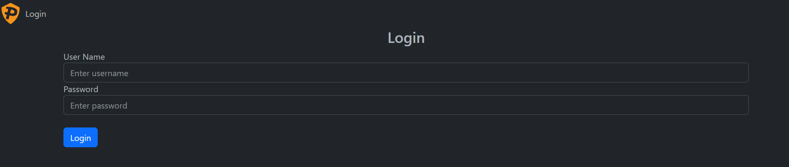

Your username is "admin" and your initial password depends on your node implementation:  
Raspiblitz - use your password B.  
MyNode - first login uses password "plebvpn".    

Once you've logged on you'll see the home screen, which displays the current status of services, 
the current version, and (if Pleb-VPN detects a new version) an Update button. It also displays 
an Uninstall button for removing Pleb-VPN from your node.
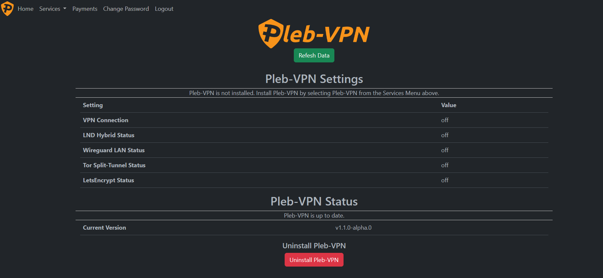

Each page has a "Refresh Data" button at the top of the screen. This button refreshes the values 
displayed by each screen's status checks. Data is refreshed when you change a setting or when you 
click the "Refresh Data" button for each screen.

### Change your password  
The menu bar has an option to change your password. If you logged on for the first time with the 
default "plebvpn" password, you should change it now using this link.

### Connect the VPN
In the Services dropdown menu, you will have five options:  
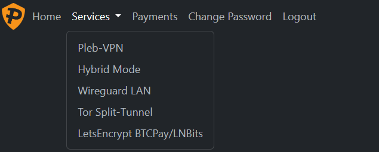

These options take you to pages where you can manage your settings and view the status of each 
of the various services. Without an active connection to your VPS, none of the services can be 
enabled yet, so step one is to enable the Pleb-VPN connection to the VPS by clicking on "Pleb-VPN" 
in the Services dropdown menu, which takes you to this page:  
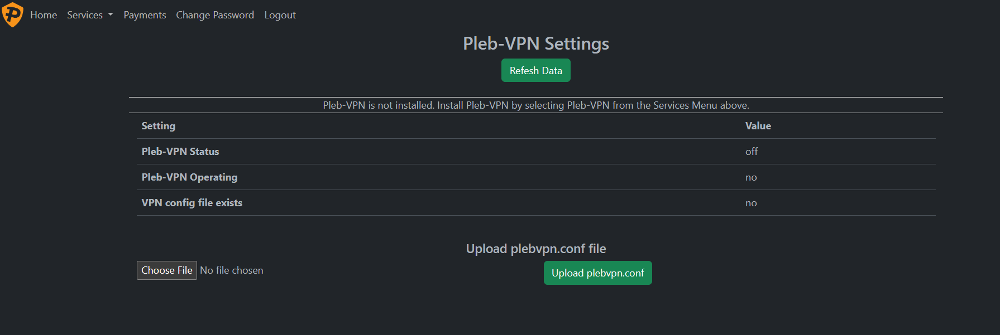

You will first have to upload the OpenVPN config file (called plebvpn.conf) 
to the node. If you already have uploaded it and are just re-enabling Pleb-VPN, it will find the 
old .conf file. Once you have a .conf file uploaded you can enable Pleb-VPN:  
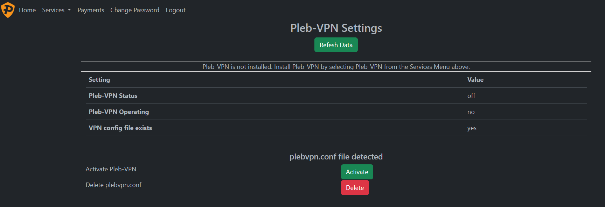

Once the script has run, it will check the status of the VPN connection and display the 
status screen:  
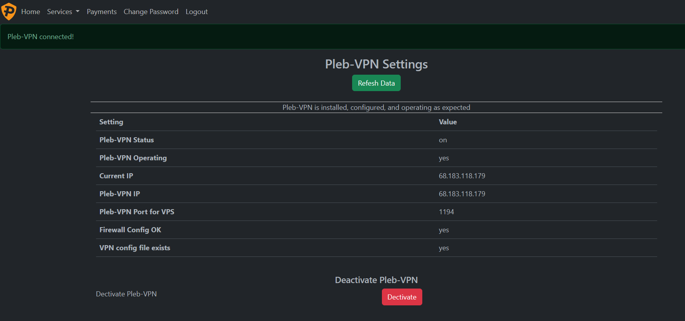

Once your VPN is connected it will automatically restart every time the node 
starts up.Now that your VPN connection to the VPS is up, you will be able to activate 
the other services!

### Go Hybrid
Navigate to the "Hybrid Mode" page under the Services dropdown. Here you will see your node 
implementation (either LND or Core Lightning). If your node runs both you will see both 
node types. The first thing you have to do is enter a port to use. This is because to share 
a server, the nodes have to use different ports. If you got your plebvpn.conf from 
another pleb, you should also get a port to use for your node. This is where you enter 
the port (this page shows LND, it's the same for Core Lightning):  
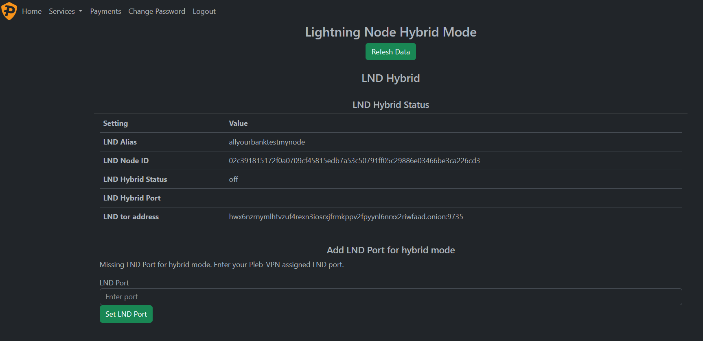

Once you've entered a port, the "Activate" button appears. To activate hybrid mode, just click it!  
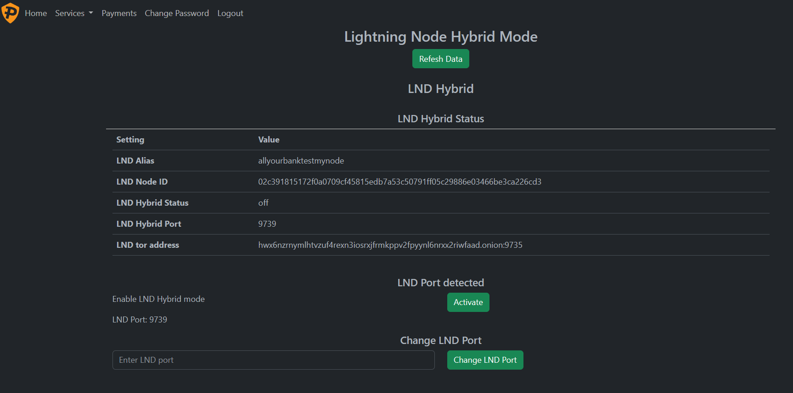
_Note: If you use both node implementations side by side, they MUST use different ports!_

After it finishes the configuration, your node implementation (LND or CLN) will be restarted, 
and the screen displays the status which should now show your new clearnet address and port. 
If it doesn't yet, then refresh the data with the "Refresh Data" button.  
_Note: It's possible that you may have to unlock your wallet 
before the data is available._  
If you have channels connected, this data should reflect on lightning explorers such as 
amboss.space within an hour (takes time for the gossip data to propagate).  
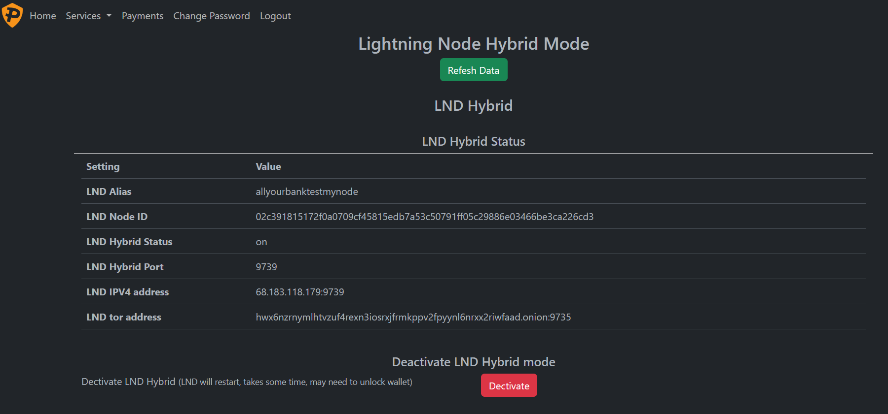

BOOM! You now have a hybrid node with a VPS!

### LetsEncrypt for BTCPay and LNBits
The LetsEncrypt service will show under the SERVICES Pleb-VPN menu only if it detects that either 
BTCPayServer or LNBits is installed. 

If you have a VPS that is capable of forwarding port 443 to your node, you can point a 
domain to your VPS IP and forward it to BTCPay or LNBits, allowing you to accept payments from 
customers on BTCPay and/or allow others to access your LNBits instance. It takes a bit more 
work to enable both on your own VPS, but it's doable. If you subscribe to @allyourbankarebelongtous, 
for an extra $1.00 US per month per service I will forward you port 443 to each service.

Once you have a domain that can reach your LNBits or BTCPayServer from the public internet over 
port 443 through your VPS, it's time to get some SSL certs! This is where this service comes in 
handy. This script configures LetsEncrypt on your Raspiblitz for either BTCPay, LNBits, or both, using 
CNAME authentication over your domain, so it works with any domain you have that allows you to enter 
a CNAME record. If you're not sure you can enter a CNAME record, contact your DNS provider to ask. 

Step 1: Have a domain name for each service you intend to secure (one for BTCPayServer and another for LNBits).  
Step 2: Have forwarded port 443 from your VPS (or contact your VPS provider to get them to forward the port).  
  _Note: If you want to enable both services from the same VPS, you'll need a reverse proxy on the VPS to decide which service receives traffic._  
Step 3: Have updated the A record of each domain to point to your VPS IP.  
Step 4: Ensure that you know how to and are ready to update the CNAME record of your domain.   

Once all of these are accomplished, go ahead and run this script. When you first run the script, 
it will display these instructions. Here's what it looks like:
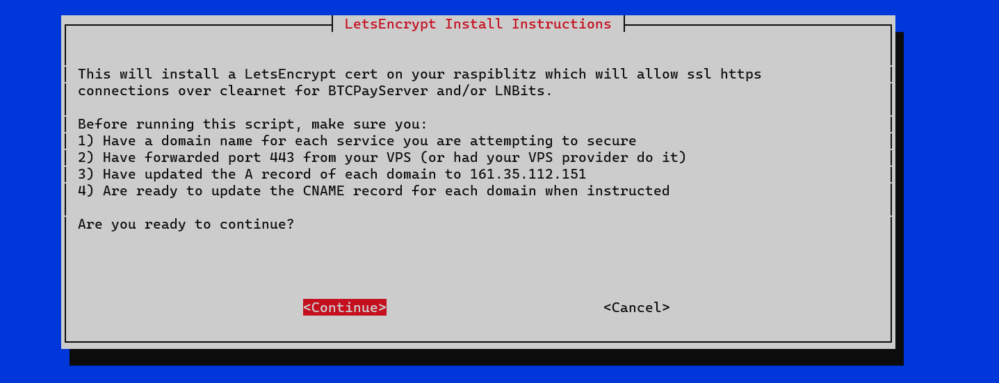
_Note: The IP the script tells you to set the A record to will be your VPS's IP_

You can tell you are ready to run the script if each domain you have (one for BTCPay and/or one 
for LNBits) can access your instance and the only issue you have is it's warning you that your 
connection is not trusted. You must also be ready to update the CNAME record of each domain.

After you acknowledge the instructions, the script will install Certbot, which will guide you 
through the install. Then the script has to gather some more information.

Next you will be asked which service you want to install. The script will only display services you 
have already installed on your node. If you intend to install LetsEncrypt for both BTCPayServer 
and LNBits, it is recommended that you do so at the same time, as you will only get one cert, so 
if you add another service at a different time you will have to re-do the cert and update both 
CNAME records. Here's what it looks like if you have both BTCPayServer and LNBits installed on your node: 

Once you have selected the service(s) that will be encrypted, the script asks for one (or both) 
domain names. In this case, I have selected both. Here's domain entry No. 1:
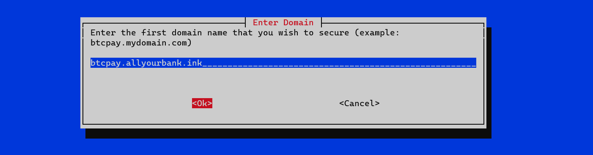

If you selected both services, you'll need two separate domain names. The script will ask for a second 
domain name if you selected both BTCPayServer and LNBits. Here's domain entry No. 2:
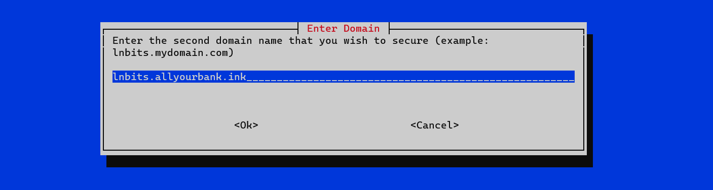

After this, the script displays instructions on entering the CNAME record. It looks like this: 
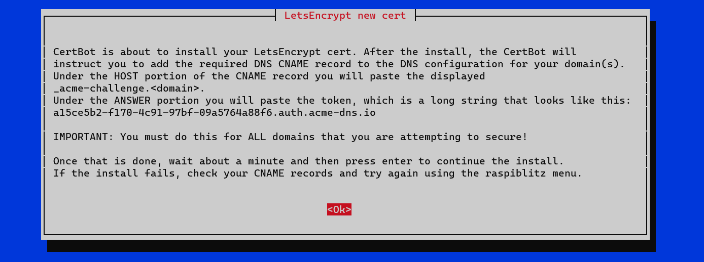

Then Certbot starts to run and will ask you if you agree to the terms:
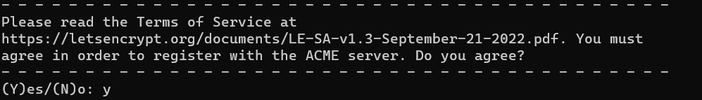

Once you agree, it will finish and display this screen:
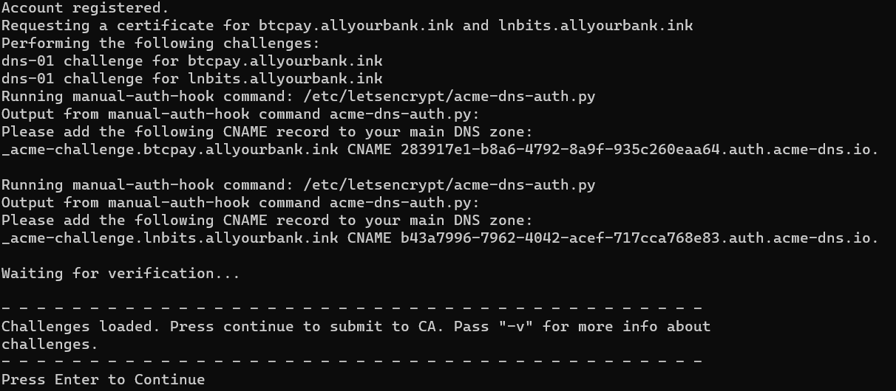

**IMPORTANT! You must update your CNAME records before pressing enter!**  
Here I have to enter my CNAME records for both btcpay.allyourbank.ink and lnbits.allyourbank.ink 
to demonstrate that I own those domains. Here's what my DNS service looks like after the update 
(this is using name.com, which has good prices and a good reputation):
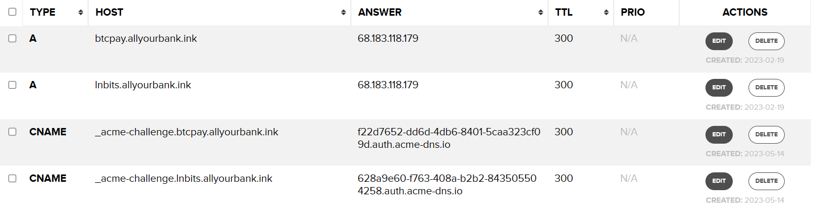

You can see that I have updated my CNAME host name for btcpay.allyourbank.ink to 
"_acme-challenge.btcpay.allyourbank.ink" and my ANSWER for CNAME as 
"293917e1-b8a6-4792-8a9f-935c260eaa64.auth.acme-dns.io" as instructed by the script.  

I did the same for my second domain, "lnbits.allyourbank.ink".

After you update your CNAME record(s), wait a bit for the update to propagate (a minute is more 
than enough usually), and then hit enter. The script should finish installing the certs and you should 
be good to go!

Here's my BTCPayServer and LNBits from the example above showing a secure connection:

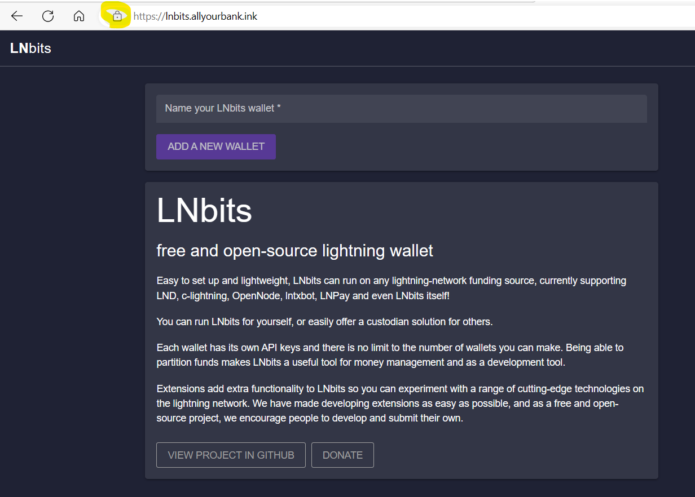

_Note: If you have already installed LetsEncrypt previously and are re-enabling it after turning it off, 
the script will detect a previous configuration and ask you if you want to keep it. Only select "Use Existing" 
if you haven't changed anything about the domains, including the CNAME record you established when first 
enabling LetsEncrypt._

Certbot will auto-update the certs when necessary, and Pleb-VPN should preserve the certs through 
Raspiblitz updates or sd card reflashes.

### Installing WireGuard
Let's install WireGuard next. Using the services menu, toggle WireGuard on.
The first thing the script will ask is for you to chose an ip address for the node. This
is a private IP address, and can be anything in the range of 10.0.0.0 to 10.255.255.252
(the reason for it only going to 252 is that there are three client IPs which need to
be added).  
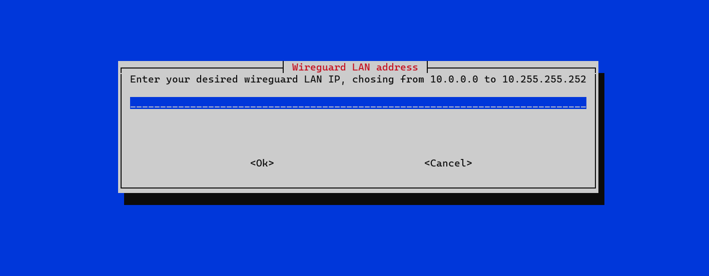

Next the script will ask you for a port, just like the hybrid mode script. 
Your VPS provider (or yourself, if you run your own server) can give you this port 
as well. Enter it here. _Do not use the same port as your node!_  

After that's done, the script will instruct you to download the WireGuard client app
from the google or apple app store. With that app, scan the QR code that will display
on the screen. This will give your phone the private key it needs to securely connect
with your node (these keys are generated locally and never leave your node until you 
download them via the WIREGUARD-CONNECT menu option). Once install is finished, the 
script will present you with the status of your connection, which will look like this:
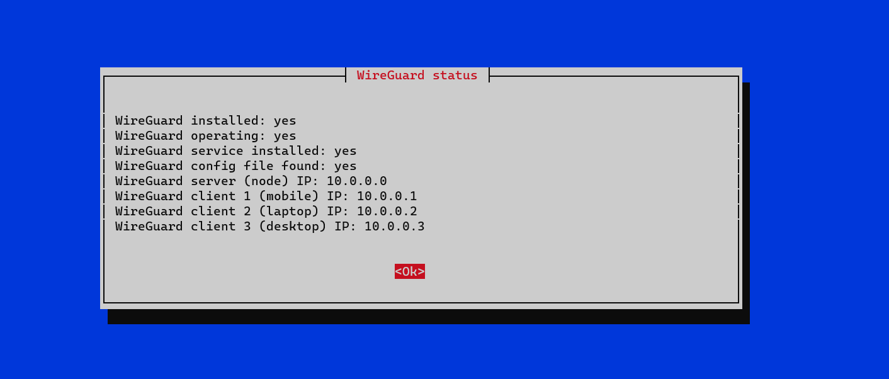
In this example I chose 10.0.0.0, so that's the IP I will use to connect to my apps on
the Raspiblitz.

You can also obtain the WireGuard client conf files from the WIREGUARD-CONNECT menu
within the main Pleb-VPN menu. You will get three files, one (mobile.conf) is also
displayed as a QR code, but the other two (laptop.conf and desktop.conf) are only
available via scp download through the WIREGUARD-CONNECT menu. To configure more than
three clients will require you to manually edit the WireGuard configuration. There
are several tutorials out there on how to do this.

Once you have WireGuard configured, you can turn it on on your phone and/or laptop/desktop, 
and connect to any service on your node securely by using the WireGuard IP you selected. For 
example, to connect to ThunderHub, have the WireGuard client activated on your phone and 
enter ip.ip.ip.ip:3010 on your phone's browser, where ip.ip.ip.ip is the WireGuard IP that
you selected. To access the blitz api, enter ip.ip.ip.ip. To configure Zeus to connect over 
WireGuard, uncheck tor and enter your WireGuard ip in place of the tor address.  

_Note: Because the connection is secured by WireGuard there is no need to enable ssl encryption, 
but you can anyways if you download the cert and install it on your phone._   

Here's a screenshot of me accessing the blitz api via WireGuard on my
phone using the 10.0.0.0 IP shown above:  
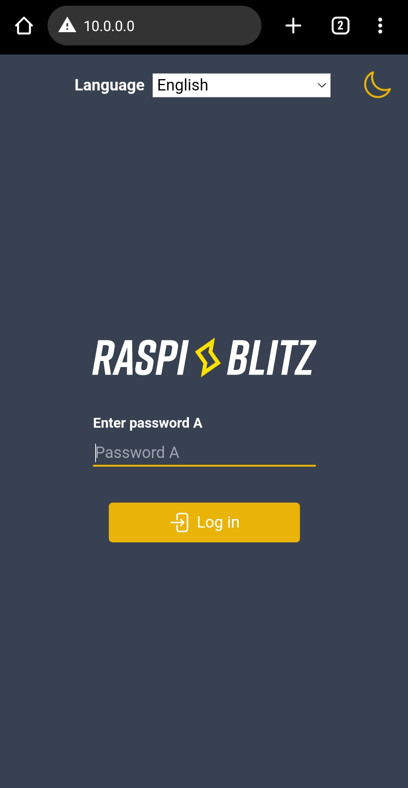

### Split-Tunneling Tor
Split-tunneling is a feature that configures traffic from tor to bypass the VPN while still
forcing everything else through the VPN. The killswitch remains enforced on your firewall,
so if the VPN drops, no clearnet traffic will go out of your node to avoid accidentally doxing 
your home IP (it will still allow SSH from the local LAN). However, enabling this will still allow 
tor, so you will gain redundancy. 

The other advantages to split-tunneling tor away from the VPN are that if there are multiple 
tor users coming from the same server then tor will probably be slower from that server, so it 
reduces congestion at the VPS. 

To enable split-tunneling for tor, just activate it from the SERVICES menu. This will configure 
tor traffic to skip the VPN by creating a special group called novpn, marking traffic generated by 
that group, creating separate routing rules for marked traffic, and finally by adding tor to that 
group. 

After the script runs, it will run through a series of tests to determine if it was successful. These 
tests take some time (up to 12 minutes) depending on how long it takes tor to re-establish a circuit 
using the new routing. After this is complete, you should get a status screen that looks like this:
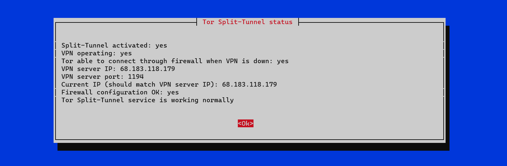

The way it checks the split-tunneling is as follows:  
- check current IP (should be VPN IP) by running `curl https://api.ipify.org`  
- disable the VPN `sudo systemctl stop openvpn@plebvpn`  
- check if clearnet is accessible (shouldn't be) `curl https://api.ipify.org`  
- check if tor is accessible (should be) `torify curl http://api.ipify.org`  
- restart Pleb-VPN `sudo systemctl start openvpn@plebvpn`  
- check clearnet IP (should be VPN IP) `curl https://api.ipify.org`  
_Note: if you run a status check of tor-split-tunneling immediately after boot or after restarting
tor it will likely fail to connect over tor. It takes about a minute for the controller to identify 
that tor is running and add it to the novpn cgroup, and then tor has to re-establish a circuit. If this 
check fails, as long as it doesn't fail such that clearnet is accessible with the VPN off, wait a 
few minutes and try again._

### Recurring Payments
Lastly, let's check out payments. Payments were included in this to encourage VPS 
operators to open their servers to other clients, and to make paying for VPS 
services easier for Plebs. Here is the PAYMENTS menu:  
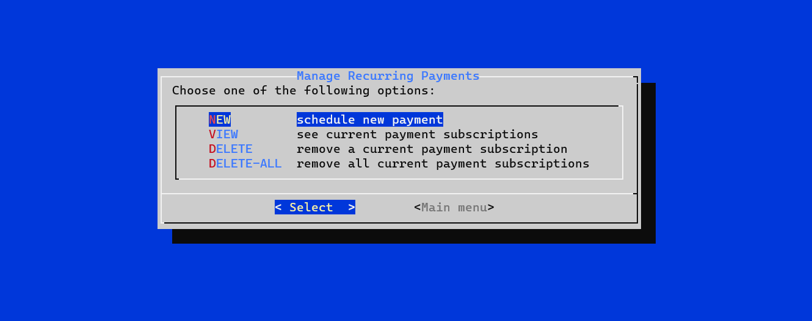

Here you can schedule recurring keysends using either LND or Core Lightning as your 
node. The service lets you decide which node implementation to use if you have both installed. 
It also lets you schedule the payment in sats or USD, and does the USD-sat conversion in 
real-time each time it sends. The PAYMENTS menu has four sections:  
NEW - lets you create a new recurring payment  
VIEW - displays all current active payments and their schedule  
DELETE - allows you to select a payment from among all of them and delete it  
DELTE-ALL - deletes all payments  

The process of scheduling a new payment is self-explanatory, but for fun here's what 
it looks like on a Raspiblitz that has both LND and Core Lightning running on it.

After selecting NEW, the script asks what denomination to use:  
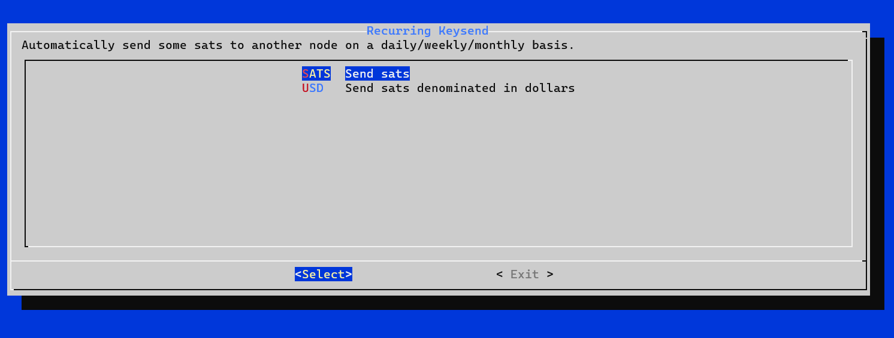

Then the script asks how much you want each payment to be. Here's a USD example:  
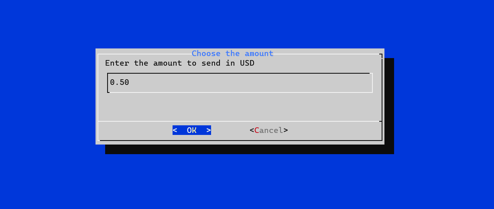

Then which node you want to use (only asks if you have both LND and Core Lightning installed and enabled):  
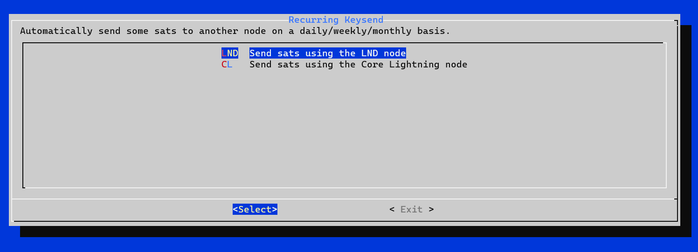

Then asks for the pubkey of the receiver:  
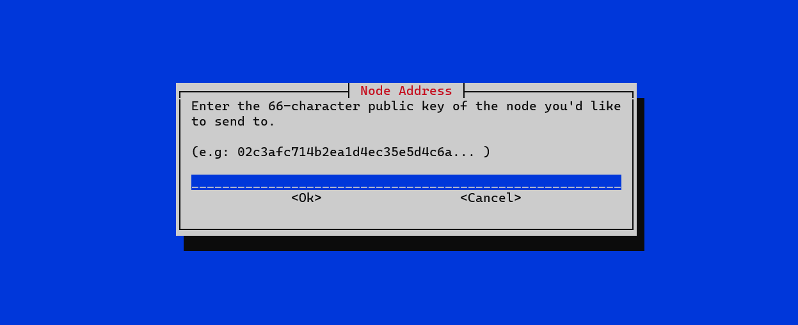

Then how often to send:  
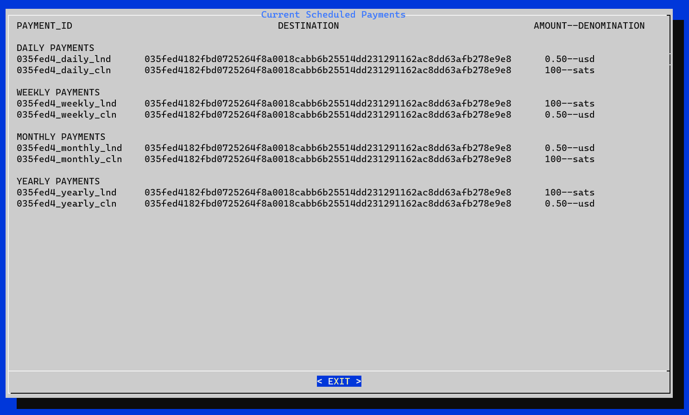

Then you are asked if you want to include a message. Keysends are anonymous, in that the receiver 
has no way of knowing who the sender is. You can include a message (required for @allyourbankarebelongtous 
subscriptions) that tells the sender who is sending and why. This will work with both LND and Core Lightning 
node implementations. If you wish to include a message, select "yes": 
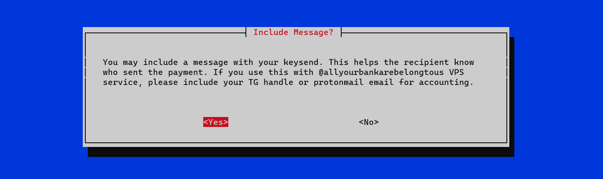

Here, enter your message (for @allyourbankarebelongtous subscriptions, include your email address or telegram 
handle):
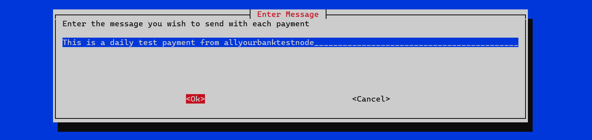

That's it. The payment is scheduled! The script will NOT send the payment right away,
it will wait until 00:00:00 UTC, and only send on the following schedule:  
DAILY - Every day at 00:00:00 UTC  
WEEKLY - Every Sunday at 00:00:00 UTC  
MONTHLY - Every 1st day of the month at 00:00:00 UTC  
YEARLY - Every 1st day of the year at 00:00:00 UTC  

Use VIEW to view your currently scheduled payments. Here's an example of me paying myself
a bunch of times for testing purposes from both LND and Core Lightning with test messages:  
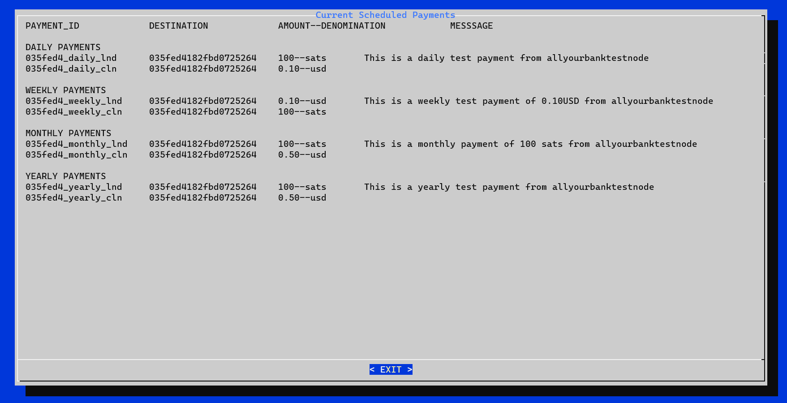

Use DELETE to get rid of a payment. Here's what that looks like:  
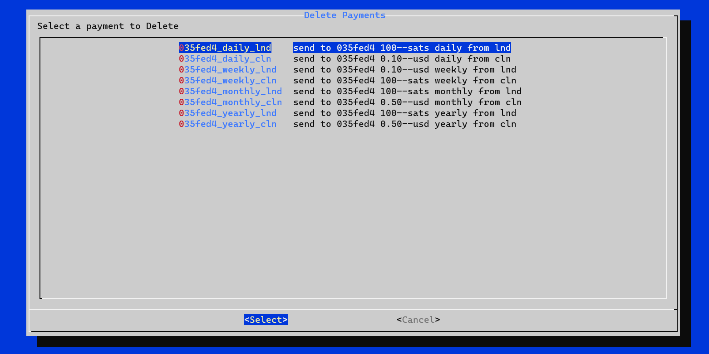

Use DELETE-ALL to delete all payments.  

Payments that are scheduled will remain through Raspiblitz updates. The payments are
enabled using systemd timers that activate the service that sends the payments. If your
node is down during a payment send time, the node will attempt to send the payment up to
10 times, and if it doesn't get a successful return after that, that payment _will NOT
send again_ until you manually re-enable the payment. To re-enable payments you can
reboot the Raspiblitz (easiest), or manually start them using systemd commands to 
restart the timer, like so:  
`sudo systemctl restart payments-daily-lnd.timer`  
`daily` can be substituded for any timeframe from `daily`, `weekly`, `monthly`, or `yearly`,
and `lnd` can be `lnd` or `cln` depending on your node implementation. 
This will restart a failed daily payment from an LND node, but will _not_ resend the failed payment.
You can change daily or lnd to your specific timing and node implementation.

To manually send an individual missed payment you can run the keysend 
script that is saved in /home/admin/pleb-vpn/payments/keysends, for example:  
`sudo -u bitcoin /home/admin/pleb-vpn/payments/keysends/_035fed4_monthly_cln_keysend.sh`  
sends the monthly payment of 0.50 USD from my Core Lightning node each time I run that command. 
(Command needs to be run as user bitcoin or it will fail for Core Lightning nodes). 

For payments that were scheduled at a certain time you can manually run that service with the following:  
`sudo systemctl start payments-<frequency>-<lnd or cln>.service`  where `<frequency>` is either
`daily`, `weekly`, `monthly`, or `yearly`, and  `<lnd or cln>` is either `lnd` if you're using
LND or `cln` if you're using Core Lightning. This will send all `<frequency>` payments from 
any `<lnd or cln>` node.

For example, to manually at any time send the payments that were scheduled on the 1st of the
month to come from my Core Lightning node I would run on the command line:  
`sudo systemctl start payments-monthly-cln.service`

### Updates or Uninstalling
The last menu, PLEB-VPN, is for updates or uninstalls. Update just pulls the latest changes
to the scripts from github (for bug fixes or new features). Uninstall will uninstall EVERYTHING
you have and restore your node to its original configuration. It will NOT delete your
plebvpn.conf file and your WireGuard config files, they will be left on the hard drive.
To remove them, you can delete /mnt/hdd/app-data/pleb-vpn and all of its contents.

Feel free to contact me on Telegram @allyourbankarebelongtous or via email at:  
allyourbankarebelongtous@protonmail.com with any questions. PRs welcome!

**Happy Routing!**
